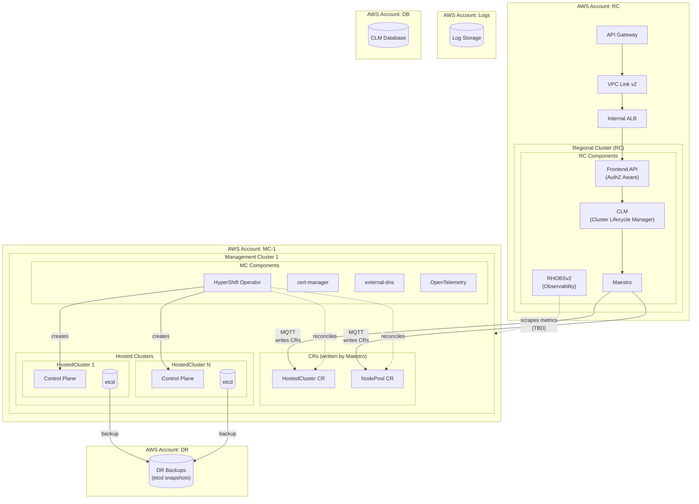
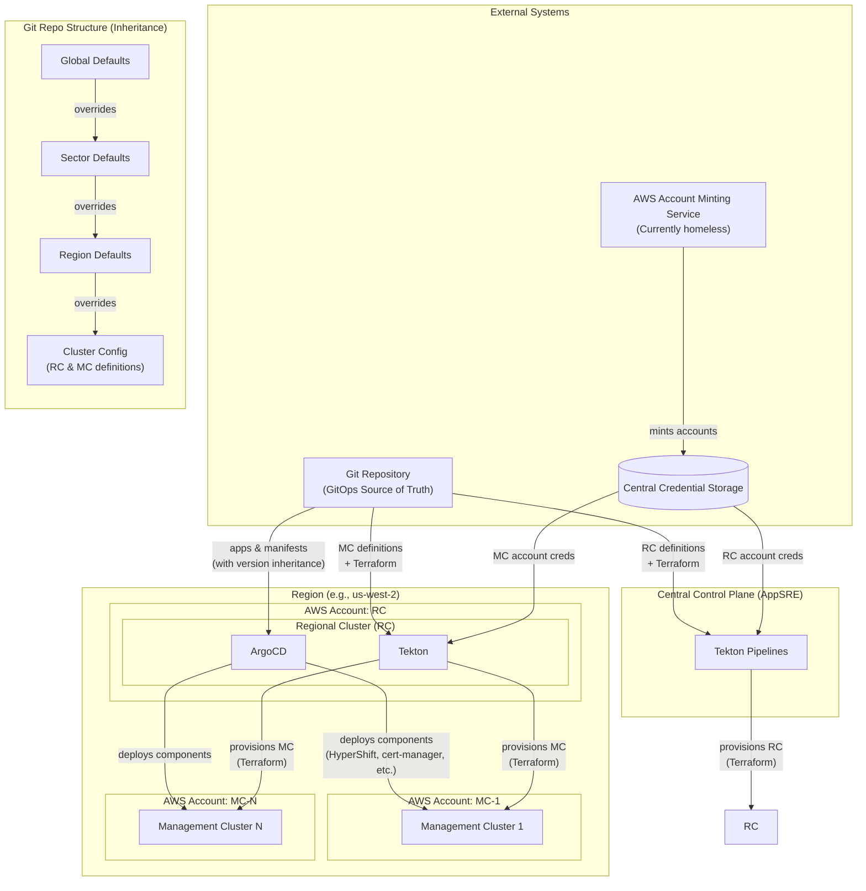

# ROSA HCP Regionality Design

## Overview

ROSA HCP Regionality is the next generation architecture for Red Hat OpenShift Service on AWS. It is a regional deployment model providing API-based cluster lifecycle management with AWS-native authentication. This architecture will eventually replace the current global ROSA HCP architecture with autonomous regional deployments.

Key characteristics:

- AWS-native identity and authentication (SigV4)
- Regional deployment model
- Declarative API modeled after Kubernetes
- GitOps-driven infrastructure and application deployment
- Zero operator access by default
- Clear data flow boundaries with bidirectional status feedback
- Regional independence (failures in one region do not affect others)

This design is documented in detail in [ADR 300](https://github.com/openshift-online/architecture/blob/main/hcm/decisions/archives/HCM-ADR-0300_Managed_OpenShift_Regional_Architecture.md). The architecture also builds on patterns established by ARO HCP and aligns with GCP HCP.

## Architecture Overview

## User Onboarding & Identity

### Marketplace Flow

1. User subscribes to the ROSA offering in AWS Marketplace
2. They are redirected to a Red Hat page where they link their AWS account with a Red Hat account
3. This information is stored globally (in a DynamoDB):
   - AWS Account ID
   - AWS ARN
   - Red Hat account
   - Subscription status

The authorizer component uses this data to gate access based on subscription status.

A separate component listens to AWS Marketplace activity via SNS and updates subscription status in DynamoDB when users unsubscribe.

### Capabilities and Support Exceptions

AWS accounts can receive additional capabilities, which are recorded globally (in the global DynamoDB).

### Export Control

The global DynamoDB maintains the relationship between AWS accounts and Red Hat accounts. Export control runs asynchronously against Red Hat accounts in this database and can ban users or accounts, preventing them from using the service.

### Authentication

Authentication is AWS-native using SigV4. Through SigV4, CLM and other regional services receive the following headers:

| Header             | Description                                                                                |
| ------------------ | ------------------------------------------------------------------------------------------ |
| `X-Amz-Caller-Arn` | Full ARN of the IAM entity (user or role) making the request                               |
| `X-Amz-Account-Id` | 12-digit AWS account ID of the caller                                                      |
| `X-Amz-User-Id`    | Unique identifier for the IAM entity; for assumed roles, includes role ID and session name |
| `X-Amz-Source-Ip`  | IP address of the client that originated the request                                       |
| `X-Amz-Request-Id` | Request ID to be used for tracing passed through each component                            |

### Tenancy Model

Tenancy is based on AWS IAM. Each user operates within their AWS account, although they can leverage native AWS mechanisms (like AssumeRole) to interact with ROSA clusters in other accounts

### Authorization Model

**Options under consideration:**

- **Option 1 - Native AWS IAM**: ROSA permission namespace (`rosa:*`), AssumeRole + SimulatePrincipalPolicy. Risks: high latency (~500ms), throttling, doesn't evaluate SCPs
- **Option 2 - REST API Endpoint Authorization**: IAM policies gate API endpoints. Risks: difficult tag-based access, less expressive policies
- **Option 3 - Kessel**: RBAC via API, evaluated regionally. Risks: non-AWS-native

**Note**: The list operation is not fine-grained in AWS—you can either list all resources or none.

## Request Flow

This section traces the lifecycle of a cluster creation request through the system.

### 1. API Gateway

Customer requests (from `rosactl` CLI) arrive at the regional API Gateway authenticated via SigV4. The API Gateway validates the signature and forwards the request with identity headers.

### 2. Frontend API

The request flows through VPC Link v2 → Internal ALB → Frontend API.

The Frontend API is authorization-aware. It:

- Exposes the customer facing REST API through an API Gateway
- Receives the customer intent
- Evaluates whether the user can perform the action
- Forwards authorized requests to CLM

This service is a stateless adapter layer that fronts CLM.

### 3. CLM (Cluster Lifecycle Manager)

CLM is the single declarative source of truth, replacing OCM, Fleet Manager, and AMS. It is built as part of Hyperfleet with three components:

- **hyperfleet-api**: Declarative REST API for clusters and node pools, following the Kubernetes controller pattern
- **hyperfleet-sentinel**: Polls the API, makes orchestration decisions, and publishes events
- **hyperfleet-adapter**: Event-driven adapter for cluster provisioning via CloudEvents

CLM follows a model of continuous reconciliation and stores cluster state (some relevant state may be cached in Maestro).

[More information](https://github.com/openshift-hyperfleet)

### 4. Maestro

Maestro applies resources to the Management Clusters over MQTT (AWS IoT Core). It writes:

- `HostedCluster` CRs
- `NodePool` CRs
- Other necessary resources

### 5. HyperShift Operator

Running on the Management Cluster, HyperShift Operator:

- Reconciles `HostedCluster` and `NodePool` CRs
- Creates the hosted cluster control plane components
- Manages the cluster lifecycle

### Status Feedback Loops

The architecture establishes clear bidirectional data flows:

**Downward (operations):**

- Customer operations → Frontend API → CLM → Maestro → Management Clusters
- Configuration changes → GitOps (ArgoCD) → Regional/Management Clusters

**Upward (status):**

- Cluster status → HyperShift → Maestro → CLM → Frontend API
- Component health → RHOBSv2 → Observability dashboards
- Audit events → SRE actions via Maestro (TBD)

This eliminates ambiguity about where state lives and how changes propagate through the system.

### API Specification

The API is declarative, similar to the Kubernetes API:

- **New specification**: Moving away from the current `api.openshift.com` spec
- **Separate resources**: HostedCluster (control plane) and NodePools are distinct resources in the API with a 1-to-N relationship
- **Flexible topology**: Supports HostedClusters without NodePools and NodePools without nodes
- **Minimal abstraction**: Goal is to pass requests to HyperShift as cleanly as possible, minimizing the abstraction layer on top of HyperShift APIs
- **Policy enforcement**: Possibility to introduce policy (e.g., OPA) owned by SRE to control which OCP Hypershift features are exposed
- **Feature parity**: The API must have feature parity with the current ROSA HCP offering

### CLI

Named `rosactl`, modeled after `eksctl` and/or AWS CLI plugin.

## Infrastructure

### AWS Account Structure

Each region requires multiple dedicated AWS accounts:

| Account       | Purpose                                      |
| ------------- | -------------------------------------------- |
| RC Account    | Regional Cluster, API Gateway, VPC Link, ALB |
| MC Account(s) | Management Clusters (1-20 per region)        |
| Logs Account  | Centralized log storage                      |
| DR Account    | Disaster recovery, etcd backups              |
| DB Account    | CLM database                                 |

**AWS Account Minting Service**: Mints accounts to be consumed by the central control plane and the region. More details TBD.

### Regional Cluster (RC)

- **Kubernetes API**: Private
- **Provisioning**: Pipeline from the central control plane (Terraform)
- **Configuration**: GitOps from the central control plane

**Components:**

- Frontend API (AuthZ aware)
- CLM (Cluster Lifecycle Manager)
- Maestro
- RHOBSv2 (Observability)
- ArgoCD
- Tekton

> **TBD**: Whether ArgoCD runs in each Regional Cluster or only in the Central Control Plane

### Management Cluster (MC)

- **Kubernetes API**: Private
- **Provisioning**: Pipeline triggered by RC (Tekton + Terraform)
- **Configuration**: GitOps from Regional Cluster

Each cluster is named individually in the git repo. Eventually this will move to a dynamic system.

**Components (installed by ArgoCD in the RC):**

- HyperShift Operator
- cert-manager
- external-dns
- OpenTelemetry

> **TBD**: Network path between Regional Cluster and Management Cluster for ArgoCD and observability purposes

### Central Control Plane

- Managed OpenShift cluster Provided by AppSRE
- Runs Tekton pipelines that provision the RCs
- GitOps paradigm with a central Git repository for all regional configuration
- Access to Regional Cluster Kubernetes APIs through private networking infrastructure
- Must support progressive delivery

### Image Registry

- Use ECR and not Quay.io
- Component to mirror OCP release images to ECR
- No quay.io or pull-secret dependencies

## Continuous Delivery

### GitOps Model

The Git repository stores:

- Terraform configurations
- ArgoCD applications
- Kubernetes manifests

### Inheritance System

Configuration uses a layered inheritance model:

1. **Global Defaults** - Base configuration for all clusters
2. **Sector Defaults** - Override for a sector (group of regions)
3. **Region Defaults** - Override for a specific region
4. **Cluster Config** - Override for a specific cluster (RC or MC)

Each layer overrides values from the previous one. This allows defining a software version hash at any level.

### Provisioning Flow

1. **RC Provisioning**: Central Control Plane (Tekton) runs Terraform to create Regional Clusters
2. **MC Provisioning**: RC (Tekton) runs Terraform to create Management Clusters. **Note**: we might provision the MCs from the CCP instead to begin with, and eventually move to RC.
3. **Component Deployment**: ArgoCD in RC deploys components to MCs based on git repo manifests

## Operations

### Observability

- Uses RHOBSv2 deployed regionally (in the Regional Cluster)
- Deploy OpenTelemetry collectors in the Management Clusters
- Implements traceability (`request_id` passed through each component)
- Must support passing the `request_id` externally for tracer bullets
- Customer Control Plane Log Forwarding on the Management Cluster
- OpenTelemetry on Management Clusters

> **TBD**: How to scrape metrics from the MCs

### EKS Cluster Access (SRE and MCS)

> **TBD**

**Goal**: Zero operator access

### Hosted Cluster Access (SRE and MCS)

> **TBD**

**Goal**: Zero operator access

### Disaster Recovery

- etcd snapshots backed up to dedicated DR AWS account

> **TBD**: Full DR strategy

### Supportability / Operability

- Zero operator access goal
- MCS collaboration
- AI integration: The architecture is designed to leverage AI capabilities for operations and support

> **TBD**: Specific AI components and integration points

### Notifications

No custom notification system—use AWS SNS instead.

### Telemetry

- Opt-out telemetry

**Risk**: No pull-secret available

> **TODO**: Identify what telemetry we are sending out today and how.

### CI / Progressive Delivery

> **TBD**

## Compliance & Security

### FIPS / FedRAMP Moderate

- All US regions will be FedRAMP Moderate certified

## Billing & Metering

- Metering is tracked within each region
- `BatchMeterUsage` AWS API reports usage to AWS

> **TBD**: Whether each region reports directly to BatchMeterUsage or a global service aggregates metering data

## Migration

Assumptions:

- There is a breaking API change (and change of API endpoint)
- User identity changes to become AWS-native (AWS account and ARN)

We will develop migration tooling to help customers move from the existing global ROSA HCP architecture to the new regional architecture, with downtime.

## Open Questions

- Authorization model selection (Options 1, 2, or 3)
- ArgoCD location (RC vs Central Control Plane)
- Network path between RC and MC
- Network path for Metrics scraping from MCs
- EKS/Hosted Cluster access model for SRE/MCS
- Full DR strategy
- CI/Progressive delivery approach
- Metering aggregation (regional vs global)
- Telemetry implementation without pull-secret

## References

- **ADR 300**: Architectural vision and detailed decisions
- **rosa-hcp repository**: PoC code and deployment artifacts (github.com/openshift-online/rosa-hcp)
- **Hyperfleet**: CLM components architecture (hyperfleet/architecture repository)
